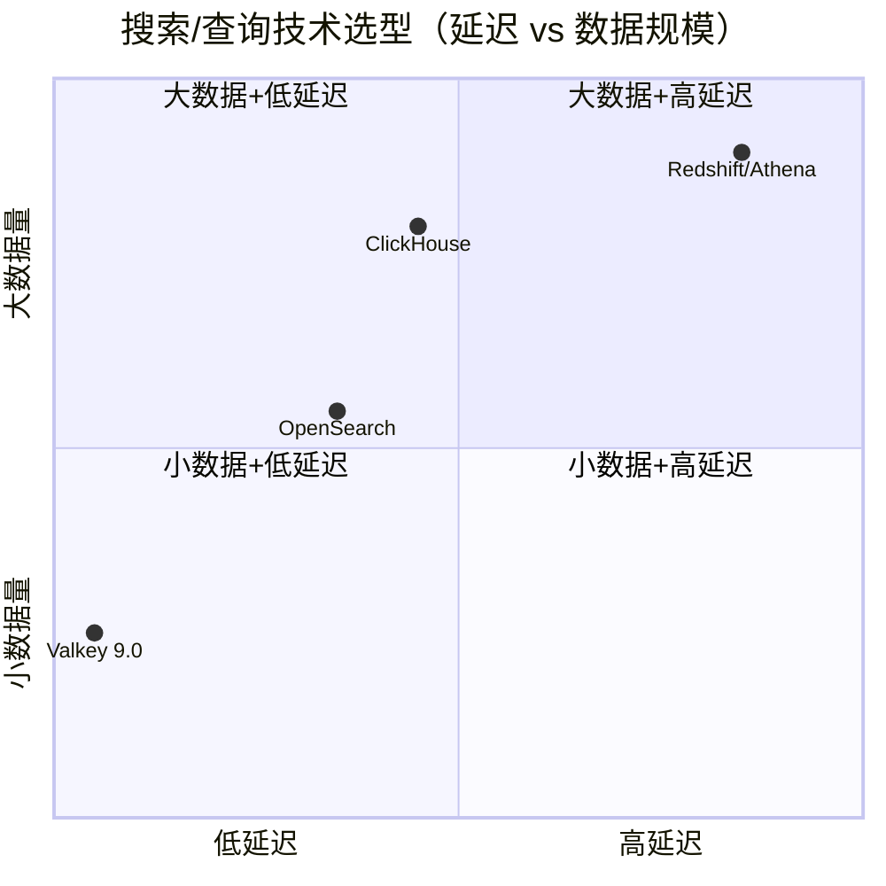
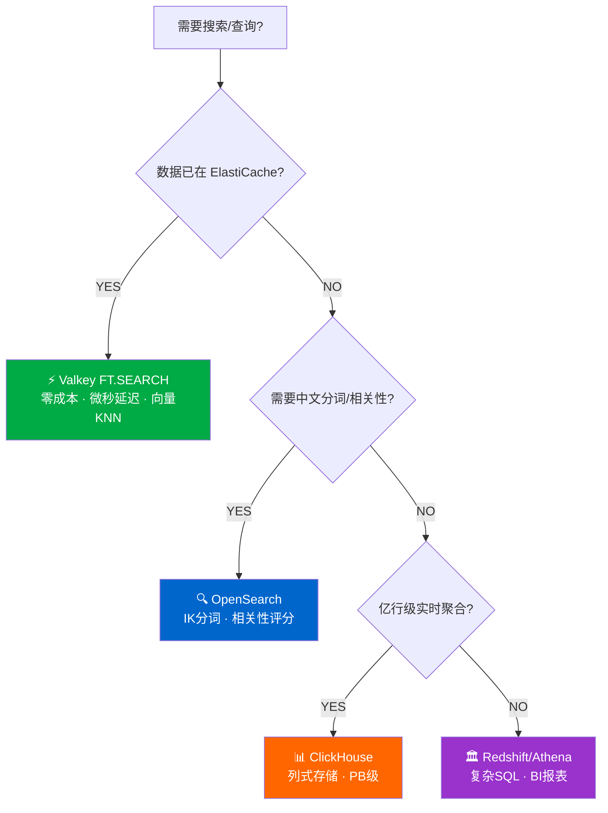

# 技术选型对比

```mermaid
quadrantChart
    title 搜索/查询技术选型（延迟 vs 数据规模）
    x-axis 低延迟 --> 高延迟
    y-axis 小数据量 --> 大数据量
    quadrant-1 大数据+高延迟
    quadrant-2 大数据+低延迟
    quadrant-3 小数据+低延迟
    quadrant-4 小数据+高延迟
    Valkey 9.0: [0.05, 0.25]
    OpenSearch: [0.35, 0.55]
    ClickHouse: [0.45, 0.80]
    Redshift/Athena: [0.85, 0.90]
```

```mermaid
flowchart TD
    A[需要搜索/查询?] --> B{数据已在 ElastiCache?}
    B -->|YES| C[⚡ Valkey FT.SEARCH\n零成本 · 微秒延迟 · 向量KNN]
    B -->|NO| D{需要中文分词/相关性?}
    D -->|YES| E[🔍 OpenSearch\nIK分词 · 相关性评分]
    D -->|NO| F{亿行级实时聚合?}
    F -->|YES| G[📊 ClickHouse\n列式存储 · PB级]
    F -->|NO| H[🏛️ Redshift/Athena\n复杂SQL · BI报表]

    style C fill:#00aa44,color:#fff
    style E fill:#0066cc,color:#fff
    style G fill:#ff6600,color:#fff
    style H fill:#9933cc,color:#fff
```
